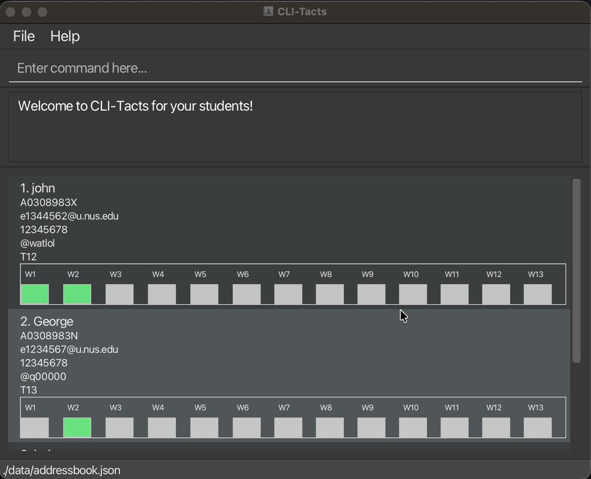

**CLI-Tacts is a desktop application for managing CS2040S tutorial groups and student information.** While it has a GUI, most of the user interactions happen using a CLI (Command Line Interface), optimised for Teaching Assistants who need to work quickly during lab and tutorial sessions.

Target users are **CS2040S Teaching Assistants** who:

- manage multiple tutorial/lab groups each semester
- need to **rapidly take attendance** and look up student details in real time
- prefer the speed and precision of a CLI over slower, form-based web portals

Instead of juggling multiple spreadsheets, CLI-Tacts **centralises student details and tutorial group information**, so that common admin tasks (adding students, editing details, listing by tutorial group, tracking attendance) can be done without disrupting the flow of teaching.

* If you are interested in using CLI-Tacts, head over to the [_Quick start_ section of the **User Guide**](UserGuide.html#quick-start).
* If you are interested in developing CLI-Tacts, the [**Developer Guide**](DeveloperGuide.html) is a good place to start.

**Acknowledgements**

* Libraries used: [JavaFX](https://openjfx.io/), [Jackson](https://github.com/FasterXML/jackson), [JUnit5](https://github.com/junit-team/junit5)
